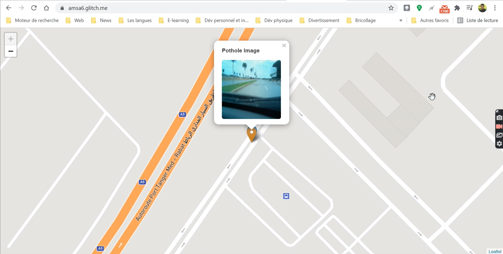
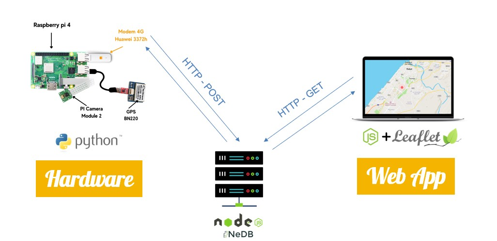

# SafeRoad

an IoT Systems that allows detection and localisation of potholes to monitor the quality of roads.

# IoT System Architecture

we can break the system into 5 componenets :

## Data Generation

- Smart things: Camera + GPS
- Processing Unit: RaspberyPI

## Data Sending & Receiving

- Network: Huawei 4G Dongle (E3372h-153) linked to Raspbery
- Backend: NodeJS & ExpressJS & HTTPS

## Data Storage & Retrieving

- NeDB

## Data Sending & Receiving (Map)

- NodeJs
- JavaScript

## Data Map Ploting

- Leaflet

# Demonstration Video

## [Demo Video](https://drive.google.com/file/d/1cuEcpcOaUutxG1opQEddCqUB-Nxv5CWZ/view?usp=sharing)

# Used Technologies

## hardware :

- Raspberry pi 4
- Modem 4G Orange (huawei E3372h-153)
- Camera PI
- GPS b220
- PowerBank

## software :

- Python
- NodeJS
- NeDB
- Glitch
- Mapbox
